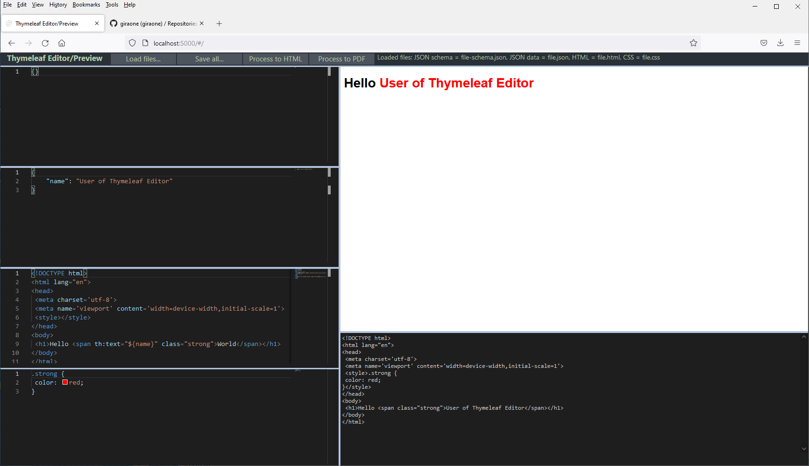
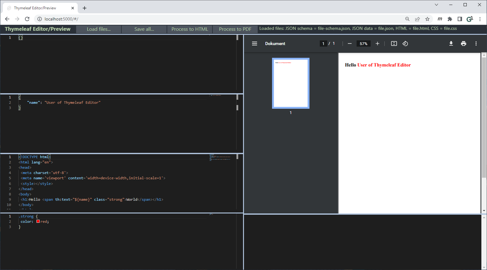
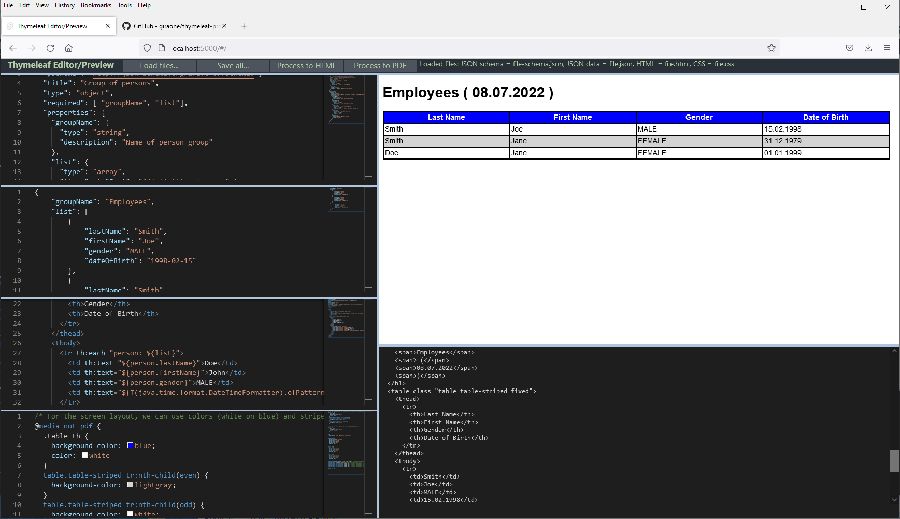

# Thymeleaf Editor with Preview

This is a browser based editor for Thymeleaf templates. It consists of

- An editor for JSON input data
- An editor for Thymeleaf HTML templates
- An editor for CSS used in the HTML template
- An optional editor for JSON schema definitions for code completing and validation of the JSON input data
- A HTML preview display for the generated result
- A HTML source code display of the result
- An optional PDF display for the PDF result (via HTML to PDF using [PD4ML v4](https://pd4ml.tech/))



Above you see on the left from top to down:
- the empty JSON schema
- the JSON input
- the HTML Thymeleaf code
- the CSS code

and on the right:
- the HTML result preview
- the HTML code preview

And here the same with PDF generation:



And a more complex example with JSON schema support and tables in *Thymeleaf*:



## Technology:

- All editors are based on Microsoft [Monaco Editor](https://microsoft.github.io/monaco-editor/) - the editor behind _Visual Studio Code_.
- The application is made with [Svelte](https://svelte.dev/).
- It needs a Java backend for applying the Thymeleaf template + CSS file on the JSON data.
  - A default implemenentation is available in my [thymeleaf-processor GitHub project](https://github.com/giraone/thymeleaf-processor).
  - This implementation can also render PDF using HTML-to-PDF conversion provided by the [PD4ML v4](https://pd4ml.tech/)) library.

## Backend server setup

The backend URLs for HTML and PDF rendering are controlled using [src/environment.js](src/environment.js).

## Hints for using Svelte

- Visual Studio:
  - https://marketplace.visualstudio.com/items?itemName=svelte.svelte-vscode
  - https://marketplace.visualstudio.com/items?itemName=fivethree.vscode-svelte-snippets
- Templates: https://github.com/sveltejs/template

## Build and running in dev mode

```bash
nvm use v16.15.1 # or sth. later
npm install
npm run dev
# or
npm run lint-dev
```

Navigate to [localhost:5000](http://localhost:5000).

## Building and running in production mode

To create an optimised version of the app:

```bash
npm run build
# or
npm run lint-build
```

You can run the newly built app with `npm run start`. This uses [sirv](https://github.com/lukeed/sirv), which is included in your package.json's `dependencies` so that the app will work when you deploy to platforms like [Heroku](https://heroku.com).

## Single-page app mode

By default, sirv will only respond to requests that match files in `public`. This is to maximise compatibility with static fileservers, allowing you to deploy your app anywhere.

If you're building a single-page app (SPA) with multiple routes, sirv needs to be able to respond to requests for _any_ path. You can make it so by editing the `"start"` command in package.json:

```js
"start": "sirv public --single"
```

## Installed Plugins

- `npm install --save-dev prettier-plugin-svelte`
- `npm install --save-dev eslint eslint-plugin-svelte3 babel-eslint`

## Known Bugs

- The resize handling is not perfect on every browser.

## Release Notes

- 1.3.0 (2022-07-08)
  - environment.js introduced
  - Support for formatting (`insertSpaces: true,  tabSize: 2`)
  - Dependency upgrades
- 1.2.0 (2022-01-15)
  - First version with PDF preview
- 1.1.0 (2021-12-20)
  - Bulma and Accordion removed
  - New resizable components
